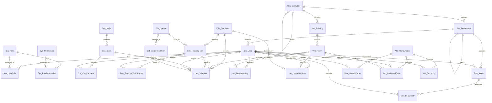

# LIMS 高校实验室管理系统 - 后端 API 文档

> 本文档描述 backend-new 后端重构的数据库设计。字段定义与实际代码（entity 类 + IEntityTypeConfiguration 配置类）严格一致。
>
> **最后更新:** 2026-06-11

---

## 数据库实体设计 (25张表)

### 一、系统基础表 (7张)

#### 1. Sys_User (用户表)

| 字段名 | 数据类型 | 说明 | 约束 |
|--------|----------|------|------|
| UserID | GUID | 用户唯一标识 | PK |
| UserName | NVARCHAR(50) | 用户名 | NOT NULL, UNIQUE |
| Password | NVARCHAR(255) | 密码(BCrypt加密) | NOT NULL |
| RealName | NVARCHAR(100) | 真实姓名 | NOT NULL |
| EmployeeNo | NVARCHAR(50) | 工号 | UNIQUE |
| IDCard | NVARCHAR(18) | 身份证号 | |
| Gender | INT | 性别(0女/1男/2未知) | DEFAULT 2 |
| Mobile | NVARCHAR(20) | 手机号 | |
| Email | NVARCHAR(100) | 邮箱 | |
| MainInstitutionID | GUID | 主机构ID | FK(Sys_Institution) |
| MainDepartmentID | GUID | 主部门ID | FK(Sys_Department) |
| UserType | NVARCHAR(20) | 用户类型(Admin/Teacher/Student) | |
| Status | INT | 状态(0禁用/1启用) | DEFAULT 1 |
| Avatar | NVARCHAR(500) | 头像URL | |
| LastLoginTime | DATETIME | 最后登录时间 | |
| LastLoginIP | NVARCHAR(50) | 最后登录IP | |
| PasswordUpdateTime | DATETIME | 密码更新时间 | |
| LoginFailCount | INT | 登录失败次数 | DEFAULT 0 |
| SortOrder | INT | 排序号 | DEFAULT 0 |
| IsDeleted | INT | 逻辑删除 | DEFAULT 0 |
| CreatedAt | DATETIME | 创建时间 | NOT NULL |
| CreatedBy | GUID | 创建人ID | |
| UpdatedAt | DATETIME | 更新时间 | |
| UpdatedBy | GUID | 更新人ID | |

#### 2. Sys_Role (角色表)

| 字段名 | 数据类型 | 说明 | 约束 |
|--------|----------|------|------|
| RoleID | GUID | 角色唯一标识 | PK |
| RoleCode | NVARCHAR(50) | 角色编码 | NOT NULL, UNIQUE |
| RoleName | NVARCHAR(100) | 角色名称 | NOT NULL |
| Description | NVARCHAR(500) | 描述 | |
| IsSystem | INT | 是否系统内置(0否/1是) | DEFAULT 0 |
| Status | INT | 状态(0禁用/1启用) | DEFAULT 1 |
| CreatedAt | DATETIME | 创建时间 | NOT NULL |
| CreatedBy | GUID | 创建人ID | |

> **注意:** Sys_Role 在实际代码中无 UpdatedAt/UpdatedBy 字段（与设计文档初版不同）。

#### 3. Sys_Permission (权限表)

| 字段名 | 数据类型 | 说明 | 约束 |
|--------|----------|------|------|
| PermissionID | GUID | 权限唯一标识 | PK |
| PermissionCode | NVARCHAR(100) | 权限编码(module:action) | NOT NULL, UNIQUE |
| PermissionName | NVARCHAR(100) | 权限名称 | NOT NULL |
| Module | NVARCHAR(50) | 所属模块 | NOT NULL |
| Description | NVARCHAR(500) | 描述 | |
| CreatedAt | DATETIME | 创建时间 | NOT NULL |

> **注意:** Sys_Permission 在实际代码中无 UpdatedAt/UpdatedBy 字段。

#### 4. Sys_UserRole (用户角色关联表)

| 字段名 | 数据类型 | 说明 | 约束 |
|--------|----------|------|------|
| UserID | GUID | 用户ID | PK, FK(Sys_User) |
| RoleID | GUID | 角色ID | PK, FK(Sys_Role) |
| AssignedAt | DATETIME | 分配时间 | NOT NULL |

#### 5. Sys_RolePermission (角色权限关联表)

| 字段名 | 数据类型 | 说明 | 约束 |
|--------|----------|------|------|
| RoleID | GUID | 角色ID | PK, FK(Sys_Role) |
| PermissionID | GUID | 权限ID | PK, FK(Sys_Permission) |
| AssignedAt | DATETIME | 分配时间 | NOT NULL |

#### 6. Sys_Institution (机构表)

| 字段名 | 数据类型 | 说明 | 约束 |
|--------|----------|------|------|
| InstitutionID | GUID | 机构唯一标识 | PK |
| InstitutionCode | NVARCHAR(50) | 机构编码 | NOT NULL, UNIQUE |
| InstitutionName | NVARCHAR(100) | 机构名称 | NOT NULL |
| ParentID | GUID | 上级机构ID | FK(Sys_Institution) |
| InstitutionType | NVARCHAR(50) | 机构类型(University/College/Department/Center) | |
| Level | INT | 机构层级(从1开始) | DEFAULT 1 |
| FullPath | NVARCHAR(500) | 完整路径(1/2/5) | |
| Status | INT | 状态(0禁用/1启用) | DEFAULT 1 |
| Description | NVARCHAR(500) | 描述 | |
| SortOrder | INT | 排序号 | DEFAULT 0 |
| CreatedAt | DATETIME | 创建时间 | NOT NULL |
| CreatedBy | GUID | 创建人ID | |
| UpdatedAt | DATETIME | 更新时间 | |
| UpdatedBy | GUID | 更新人ID | |

#### 7. Sys_Department (部门表)

| 字段名 | 数据类型 | 说明 | 约束 |
|--------|----------|------|------|
| DepartmentID | GUID | 部门唯一标识 | PK |
| DepartmentCode | NVARCHAR(50) | 部门编码 | NOT NULL, UNIQUE |
| DepartmentName | NVARCHAR(100) | 部门名称 | NOT NULL |
| InstitutionID | GUID | 所属机构ID | FK(Sys_Institution) |
| ParentID | GUID | 父部门ID | FK(Sys_Department) |
| DepartmentType | NVARCHAR(50) | 部门类型 | |
| Level | INT | 部门层级 | DEFAULT 1 |
| FullPath | NVARCHAR(500) | 完整路径 | |
| ManagerID | GUID | 部门负责人ID | FK(Sys_User) |
| Status | INT | 状态(0禁用/1启用) | DEFAULT 1 |
| Description | NVARCHAR(500) | 描述 | |
| SortOrder | INT | 排序号 | DEFAULT 0 |
| CreatedAt | DATETIME | 创建时间 | NOT NULL |
| CreatedBy | GUID | 创建人ID | |
| UpdatedAt | DATETIME | 更新时间 | |
| UpdatedBy | GUID | 更新人ID | |

---

### 二、基础教学表 (7张)

#### 8. Edu_Semester (学期表)

| 字段名 | 数据类型 | 说明 | 约束 |
|--------|----------|------|------|
| SemesterID | GUID | 学期唯一标识 | PK |
| SemesterCode | NVARCHAR(50) | 学期编码 | NOT NULL, UNIQUE |
| SemesterName | NVARCHAR(100) | 学期名称 | NOT NULL |
| SchoolYear | NVARCHAR(20) | 学年(如2024-2025) | |
| SemesterNo | INT | 学期序号(1或2) | |
| StartDate | DATETIME | 学期开始日期 | |
| EndDate | DATETIME | 学期结束日期 | |
| TotalWeeks | INT | 总周数 | |
| IsCurrent | INT | 是否当前学期(0否/1是) | DEFAULT 0 |
| Status | INT | 状态(0禁用/1启用) | DEFAULT 1 |
| Description | NVARCHAR(500) | 描述 | |
| SortOrder | INT | 排序号 | DEFAULT 0 |
| IsDeleted | INT | 逻辑删除 | DEFAULT 0 |
| CreatedAt | DATETIME | 创建时间 | NOT NULL |
| CreatedBy | GUID | 创建人ID | |
| UpdatedAt | DATETIME | 更新时间 | |
| UpdatedBy | GUID | 更新人ID | |

#### 9. Edu_Course (课程表)

| 字段名 | 数据类型 | 说明 | 约束 |
|--------|----------|------|------|
| CourseID | GUID | 课程唯一标识 | PK |
| CourseCode | NVARCHAR(50) | 课程编码 | NOT NULL, UNIQUE |
| CourseName | NVARCHAR(200) | 课程中文名 | NOT NULL |
| CourseNameEn | NVARCHAR(200) | 课程英文名 | |
| CourseNature | NVARCHAR(20) | 课程性质(必修/选修/公选) | |
| Credits | DECIMAL(10,2) | 学分 | |
| TotalHours | INT | 总学时 | |
| LectureHours | INT | 讲授学时 | |
| PracticeHours | INT | 实践学时 | |
| LabHours | INT | 实验学时 | |
| OnlineHours | INT | 线上学时 | |
| OpenSemesters | NVARCHAR(50) | 开设学期(如"1,2") | |
| SortOrder | INT | 排序号 | DEFAULT 0 |
| Status | INT | 状态(0禁用/1启用) | DEFAULT 1 |
| Description | NVARCHAR(1000) | 课程描述 | |
| IsDeleted | INT | 逻辑删除 | DEFAULT 0 |
| CreatedAt | DATETIME | 创建时间 | NOT NULL |
| CreatedBy | GUID | 创建人ID | |
| UpdatedAt | DATETIME | 更新时间 | |
| UpdatedBy | GUID | 更新人ID | |

> **注意:** Edu_Course 在实际代码中无 UpdatedAt/UpdatedBy 字段（与设计文档初版不同）。

#### 10. Edu_Major (专业表)

| 字段名 | 数据类型 | 说明 | 约束 |
|--------|----------|------|------|
| MajorID | GUID | 专业唯一标识 | PK |
| MajorCode | NVARCHAR(50) | 专业编码 | NOT NULL, UNIQUE |
| MajorName | NVARCHAR(200) | 专业中文名 | NOT NULL |
| MajorNameEn | NVARCHAR(200) | 专业英文名 | |
| InstitutionID | GUID | 所属机构ID | FK(Sys_Institution) |
| DepartmentID | GUID | 所属部门ID | FK(Sys_Department) |
| DegreeLevel | NVARCHAR(20) | 学历层次(本科/硕士/博士/专科) | |
| Duration | INT | 学制年限(年) | |
| DegreeName | NVARCHAR(100) | 学位名称(工学学士等) | |
| SortOrder | INT | 排序号 | DEFAULT 0 |
| Status | INT | 状态(0禁用/1启用) | DEFAULT 1 |
| Description | NVARCHAR(500) | 描述 | |
| IsDeleted | INT | 逻辑删除 | DEFAULT 0 |
| CreatedAt | DATETIME | 创建时间 | NOT NULL |
| CreatedBy | GUID | 创建人ID | |
| UpdatedAt | DATETIME | 更新时间 | |
| UpdatedBy | GUID | 更新人ID | |

#### 11. Edu_Class (班级表)

| 字段名 | 数据类型 | 说明 | 约束 |
|--------|----------|------|------|
| ClassID | GUID | 班级唯一标识 | PK |
| ClassCode | NVARCHAR(50) | 班级编码 | NOT NULL, UNIQUE |
| ClassName | NVARCHAR(100) | 班级名称 | NOT NULL |
| InstitutionID | GUID | 所属机构ID | FK(Sys_Institution) |
| DepartmentID | GUID | 所属部门ID | FK(Sys_Department) |
| MajorID | GUID | 所属专业ID | FK(Edu_Major) |
| GradeName | NVARCHAR(20) | 年级名称(如2021) | |
| MonitorID | GUID | 班长ID | FK(Sys_User) |
| HeadTeacherID | GUID | 班主任ID | FK(Sys_User) |
| StudentCount | INT | 学生人数 | |
| SortOrder | INT | 排序号 | DEFAULT 0 |
| Status | INT | 状态(0禁用/1启用) | DEFAULT 1 |
| Description | NVARCHAR(500) | 描述 | |
| IsDeleted | INT | 逻辑删除 | DEFAULT 0 |
| CreatedAt | DATETIME | 创建时间 | NOT NULL |
| CreatedBy | GUID | 创建人ID | |
| UpdatedAt | DATETIME | 更新时间 | |
| UpdatedBy | GUID | 更新人ID | |

#### 12. Edu_ClassStudent (班级学生关联表)

| 字段名 | 数据类型 | 说明 | 约束 |
|--------|----------|------|------|
| ClassID | GUID | 班级ID | PK, FK(Edu_Class) |
| StudentID | GUID | 学生ID | PK, FK(Sys_User) |
| JoinedAt | DATETIME | 加入时间 | NOT NULL |

#### 13. Edu_TeachingTask (教学任务表)

| 字段名 | 数据类型 | 说明 | 约束 |
|--------|----------|------|------|
| TaskID | GUID | 教学任务唯一标识 | PK |
| TaskCode | NVARCHAR(50) | 教学任务编码 | NOT NULL, UNIQUE |
| SemesterID | GUID | 所属学期ID | FK(Edu_Semester) |
| CourseID | GUID | 课程ID | FK(Edu_Course) |
| MajorID | GUID | 专业ID | FK(Edu_Major) |
| ClassID | GUID | 班级ID | FK(Edu_Class) |
| WeeklyHours | INT | 周课时 | |
| StartWeek | INT | 开始周次 | |
| EndWeek | INT | 结束周次 | |
| ExamMode | NVARCHAR(50) | 考核方式 | |
| SortOrder | INT | 排序号 | DEFAULT 0 |
| Status | INT | 状态(0禁用/1启用) | DEFAULT 1 |
| Description | NVARCHAR(500) | 描述 | |
| IsDeleted | INT | 逻辑删除 | DEFAULT 0 |
| CreatedAt | DATETIME | 创建时间 | NOT NULL |
| CreatedBy | GUID | 创建人ID | |
| UpdatedAt | DATETIME | 更新时间 | |
| UpdatedBy | GUID | 更新人ID | |

#### 14. Edu_TeachingTaskTeacher (教学任务教师关联表)

| 字段名 | 数据类型 | 说明 | 约束 |
|--------|----------|------|------|
| ID | GUID | 主键 | PK |
| TaskID | GUID | 教学任务ID | FK(Edu_TeachingTask) |
| TeacherID | GUID | 教师ID | FK(Sys_User) |
| TeacherRole | NVARCHAR(20) | 教师角色(主讲/助教) | DEFAULT '主讲' |
| AssignedAt | DATETIME | 分配时间 | NOT NULL |

---

### 三、场地管理表 (2张)

#### 15. Ven_Building (楼宇表)

| 字段名 | 数据类型 | 说明 | 约束 |
|--------|----------|------|------|
| BuildingID | GUID | 楼宇唯一标识 | PK |
| BuildingCode | NVARCHAR(50) | 楼宇编码 | NOT NULL, UNIQUE |
| BuildingName | NVARCHAR(200) | 楼宇名称 | NOT NULL |
| BuildingNameEn | NVARCHAR(200) | 楼宇英文名 | |
| InstitutionID | GUID | 所属机构ID | FK(Sys_Institution) |
| Address | NVARCHAR(500) | 地址 | |
| TotalFloors | INT | 总层数 | |
| Area | DECIMAL(18,2) | 建筑面积 | |
| BuildYear | INT | 建造年份 | |
| UseType | NVARCHAR(50) | 用途类型 | |
| SortOrder | INT | 排序号 | DEFAULT 0 |
| Status | INT | 状态(0禁用/1启用) | DEFAULT 1 |
| Description | NVARCHAR(500) | 描述 | |
| IsDeleted | INT | 逻辑删除 | DEFAULT 0 |
| CreatedAt | DATETIME | 创建时间 | NOT NULL |
| CreatedBy | GUID | 创建人ID | |
| UpdatedAt | DATETIME | 更新时间 | |
| UpdatedBy | GUID | 更新人ID | |

#### 16. Ven_Room (实验室/场地表)

| 字段名 | 数据类型 | 说明 | 约束 |
|--------|----------|------|------|
| RoomID | GUID | 场地唯一标识 | PK |
| RoomCode | NVARCHAR(50) | 场地编码 | NOT NULL, UNIQUE |
| RoomName | NVARCHAR(200) | 场地名称 | NOT NULL |
| BuildingID | GUID | 所属楼宇ID | FK(Ven_Building) |
| FloorNo | INT | 楼层号 | |
| RoomNumber | NVARCHAR(50) | 房间号 | |
| SeatCount | INT | 座位数量 | |
| Area | DECIMAL(18,2) | 面积 | |
| RoomType | NVARCHAR(50) | 场地类型(计算机实验室/多媒体教室等) | |
| Photo | NVARCHAR(1000) | 照片URL | |
| IsAvailable | INT | 是否可用(0否/1是) | DEFAULT 1 |
| SortOrder | INT | 排序号 | DEFAULT 0 |
| Status | INT | 状态(0禁用/1启用) | DEFAULT 1 |
| Description | NVARCHAR(500) | 描述 | |
| IsDeleted | INT | 逻辑删除 | DEFAULT 0 |
| CreatedAt | DATETIME | 创建时间 | NOT NULL |
| CreatedBy | GUID | 创建人ID | |
| UpdatedAt | DATETIME | 更新时间 | |
| UpdatedBy | GUID | 更新人ID | |

---

### 四、排课预约表 (4张)

#### 17. Lab_Schedule (排课记录表)

| 字段名 | 数据类型 | 说明 | 约束 |
|--------|----------|------|------|
| ScheduleID | GUID | 排课唯一标识 | PK |
| SemesterID | GUID | 学期ID | FK(Edu_Semester) |
| RoomID | GUID | 实验室ID | FK(Ven_Room) |
| TaskID | GUID | 教学任务ID | FK(Edu_TeachingTask) |
| WeekNo | INT | 教学周次 | |
| DayOfWeek | INT | 星期几(1-7) | |
| SectionNo | NVARCHAR(50) | 节次(如"1-2节") | |
| CourseName | NVARCHAR(200) | 课程名称 | |
| ClassID | GUID | 班级ID | FK(Edu_Class) |
| TeacherID | GUID | 授课教师ID | FK(Sys_User) |
| ExperimentItemID | GUID | 实验项目ID | FK(Lab_ExperimentItem) |
| ScheduleType | NVARCHAR(50) | 排课类型(CentralScheduling/BookingApply/SelfBooking) | DEFAULT 'CentralScheduling' |
| Status | INT | 状态(0禁用/1启用) | DEFAULT 1 |
| Remark | NVARCHAR(500) | 备注 | |
| IsDeleted | INT | 逻辑删除 | DEFAULT 0 |
| CreatedAt | DATETIME | 创建时间 | NOT NULL |
| CreatedBy | GUID | 操作人ID | |
| UpdatedAt | DATETIME | 更新时间 | |

> **注意:** Lab_Schedule 在实际代码中无 UpdatedBy 字段。

#### 18. Lab_ExperimentItem (实验项目库)

| 字段名 | 数据类型 | 说明 | 约束 |
|--------|----------|------|------|
| ItemID | GUID | 项目唯一标识 | PK |
| ItemCode | NVARCHAR(50) | 项目编码 | NOT NULL, UNIQUE |
| ItemName | NVARCHAR(200) | 实验项目名称 | NOT NULL |
| CourseID | GUID | 所属课程ID | FK(Edu_Course) |
| ExperimentType | NVARCHAR(50) | 实验类型(基础/综合/设计/其他) | |
| StandardHours | INT | 计划学时 | |
| Status | INT | 状态(0禁用/1启用) | DEFAULT 1 |
| IsDeleted | INT | 逻辑删除 | DEFAULT 0 |
| CreatedAt | DATETIME | 创建时间 | NOT NULL |
| CreatedBy | GUID | 创建人ID | |

#### 19. Lab_BookingApply (预约申请表)

| 字段名 | 数据类型 | 说明 | 约束 |
|--------|----------|------|------|
| ApplyID | GUID | 申请唯一标识 | PK |
| ApplyCode | NVARCHAR(50) | 申请单号 | NOT NULL, UNIQUE |
| ApplicantID | GUID | 申请人ID | FK(Sys_User) |
| ApplicantType | NVARCHAR(20) | 申请人身份(教师/学生) | |
| RoomID | GUID | 申请实验室ID | FK(Ven_Room) |
| Purpose | NVARCHAR(1000) | 申请用途/原因 | |
| TargetDate | DATETIME | 使用日期 | |
| TargetSection | NVARCHAR(50) | 使用节次 | |
| WeekNo | INT | 所属周次 | |
| EstimatedPeople | INT | 预计人数 | |
| AuditStatus | NVARCHAR(20) | 审批状态(Pending/Approved/Rejected) | DEFAULT 'Pending' |
| AuditOpinion | NVARCHAR(500) | 审批意见/驳回原因 | |
| AuditorID | GUID | 审批管理员ID | FK(Sys_User) |
| AuditTime | DATETIME | 审批时间 | |
| IsDeleted | INT | 逻辑删除 | DEFAULT 0 |
| CreatedAt | DATETIME | 申请提交时间 | NOT NULL |
| CreatedBy | GUID | 操作人ID | |

#### 20. Lab_UsageRegister (使用登记表)

| 字段名 | 数据类型 | 说明 | 约束 |
|--------|----------|------|------|
| RegisterID | GUID | 登记唯一标识 | PK |
| ScheduleID | GUID | 关联排课记录ID | FK(Lab_Schedule) |
| BookingApplyID | GUID | 关联预约申请ID | FK(Lab_BookingApply) |
| SemesterID | GUID | 学期ID | FK(Edu_Semester) |
| RoomID | GUID | 实验室ID | FK(Ven_Room) |
| ItemName | NVARCHAR(200) | 实验项目名称/授课内容 | |
| ExperimentType | NVARCHAR(50) | 实验类型 | |
| PlannedHours | INT | 计划学时 | |
| ActualHours | DECIMAL(10,2) | 实际使用时长 | |
| ClassName | NVARCHAR(100) | 使用班级名称 | |
| ExpectedCount | INT | 应到人数 | |
| ActualCount | INT | 实到人数 | |
| AttendanceRecord | NVARCHAR(500) | 考勤记录 | |
| TeachingRecord | NVARCHAR(200) | 教学情况记录 | |
| DeviceRecord | NVARCHAR(200) | 仪器设备情况 | |
| RegisterStatus | NVARCHAR(20) | 登记状态(Pending/Completed/Overdue) | DEFAULT 'Pending' |
| RegisterUserID | GUID | 填报人ID | FK(Sys_User), NOT NULL |
| RegisterTime | DATETIME | 填报时间 | NOT NULL |
| IsDeleted | INT | 逻辑删除 | DEFAULT 0 |
| CreatedAt | DATETIME | 创建时间 | NOT NULL |
| CreatedBy | GUID | 操作人ID | |

> **注意:** Lab_UsageRegister 在实际代码中无 UpdatedAt/UpdatedBy 字段。RegisterUserID 为非空 GUID（非空值由 `?? Guid.Empty` 保证）。

---

### 五、设备管理表 (2张)

#### 21. Dev_Asset (设备资产台账)

| 字段名 | 数据类型 | 说明 | 约束 |
|--------|----------|------|------|
| AssetID | GUID | 设备唯一标识 | PK |
| AssetCode | NVARCHAR(50) | 资产编号(条码号) | NOT NULL, UNIQUE |
| DeviceName | NVARCHAR(200) | 设备名称 | NOT NULL |
| ModelNumber | NVARCHAR(100) | 型号 | |
| Specification | NVARCHAR(200) | 规格 | |
| Category | NVARCHAR(50) | 类别/分类 | |
| Unit | NVARCHAR(20) | 计量单位 | DEFAULT '台' |
| PurchaseDate | DATETIME | 购入日期 | |
| Brand | NVARCHAR(100) | 品牌 | |
| SerialNumber | NVARCHAR(100) | 序列号/出厂编号 | |
| Price | DECIMAL(18,2) | 价格 | |
| FundingSource | NVARCHAR(100) | 经费来源 | |
| ServiceLife | INT | 使用年限 | |
| Supplier | NVARCHAR(200) | 供应商 | |
| WarrantyPeriod | DATETIME | 保修期至 | |
| StorageLocation | NVARCHAR(200) | 存放位置 | |
| ResponsibleUserID | GUID | 责任人ID | FK(Sys_User) |
| DepartmentID | GUID | 所属部门ID | FK(Sys_Department) |
| IsImportant | INT | 是否重要设备(0否/1是) | DEFAULT 0 |
| LabelInfo | NVARCHAR(200) | 标签/备注信息 | |
| PhotoPath | NVARCHAR(1000) | 设备照片路径 | |
| DeviceStatus | NVARCHAR(50) | 设备状态(Available/OnLoan/Maintenance/Scrap) | DEFAULT 'Available' |
| TotalQuantity | INT | 总数量 | DEFAULT 1 |
| AvailableQuantity | INT | 可用数量 | DEFAULT 1 |
| Status | INT | 状态(0禁用/1启用) | DEFAULT 1 |
| Description | NVARCHAR(500) | 描述 | |
| IsDeleted | INT | 逻辑删除 | DEFAULT 0 |
| CreatedAt | DATETIME | 入库登记时间 | NOT NULL |
| CreatedBy | GUID | 创建人ID | |
| UpdatedAt | DATETIME | 更新时间 | |
| UpdatedBy | GUID | 更新人ID | |

> **注意:** Dev_Asset 在实际代码中无 UpdatedAt/UpdatedBy 字段。

#### 22. Dev_LoanApply (设备借还申请)

| 字段名 | 数据类型 | 说明 | 约束 |
|--------|----------|------|------|
| LoanID | GUID | 借还唯一标识 | PK |
| AssetID | GUID | 设备资产ID | FK(Dev_Asset) |
| BorrowerID | GUID | 借用人ID | FK(Sys_User) |
| BorrowerType | NVARCHAR(20) | 借用人类型(教师/学生) | |
| LoanPurpose | NVARCHAR(1000) | 借用用途/关联课程班级 | |
| LoanQuantity | INT | 借出数量 | DEFAULT 1 |
| ExpectedReturnDate | DATETIME | 预计归还时间 | |
| ActualLoanTime | DATETIME | 实际借出放行时间 | |
| ActualReturnTime | DATETIME | 实际归还时间 | |
| AuditStatus | NVARCHAR(20) | 审批状态(Pending/Approved/Rejected/Returned) | DEFAULT 'Pending' |
| AuditorID | GUID | 审批管理员ID | FK(Sys_User) |
| AuditTime | DATETIME | 审批时间 | |
| AuditOpinion | NVARCHAR(500) | 审批意见 | |
| ReturnConfirmUserID | GUID | 归还确认人ID | FK(Sys_User) |
| DeviceCondition | NVARCHAR(50) | 归还时设备状况(完好/损坏) | |
| Remark | NVARCHAR(500) | 备注 | |
| IsDeleted | INT | 逻辑删除 | DEFAULT 0 |
| CreatedAt | DATETIME | 创建时间 | NOT NULL |
| CreatedBy | GUID | 操作人ID | |

---

### 六、耗材管理表 (4张)

#### 23. Mat_Consumable (耗材基础表)

| 字段名 | 数据类型 | 说明 | 约束 |
|--------|----------|------|------|
| MatID | GUID | 耗材唯一标识 | PK |
| MatCode | NVARCHAR(50) | 耗材编号 | NOT NULL, UNIQUE |
| MatName | NVARCHAR(200) | 耗材名称 | NOT NULL |
| Category | NVARCHAR(50) | 分类(化学试剂/电子元件/玻璃仪器等) | NOT NULL |
| SpecModel | NVARCHAR(200) | 规格型号 | |
| Unit | NVARCHAR(20) | 单位(瓶/个/盒) | DEFAULT '个' |
| CurrentStock | DECIMAL(18,4) | 当前总库存 | DEFAULT 0 |
| AvailableStock | DECIMAL(18,4) | 可用库存 | DEFAULT 0 |
| LockedStock | DECIMAL(18,4) | 锁定库存(审批中被预占) | DEFAULT 0 |
| MinStockThreshold | DECIMAL(18,4) | 最低库存警戒线 | DEFAULT 0 |
| StorageLocation | NVARCHAR(200) | 存放位置 | |
| Supplier | NVARCHAR(200) | 供应商 | |
| UnitPrice | DECIMAL(18,2) | 单价 | |
| Status | INT | 状态(0禁用/1启用) | DEFAULT 1 |
| IsDeleted | INT | 逻辑删除 | DEFAULT 0 |
| CreatedAt | DATETIME | 创建时间 | NOT NULL |
| CreatedBy | GUID | 创建人ID | |
| UpdatedAt | DATETIME | 更新时间 | |
| UpdatedBy | GUID | 更新人ID | |

> **注意:** Mat_Consumable.Category 在实际代码中为非空字符串（实体定义不含 ?），设计文档列为可空是保守估计。

#### 24. Mat_InboundOrder (耗材入库单)

| 字段名 | 数据类型 | 说明 | 约束 |
|--------|----------|------|------|
| InboundID | GUID | 入库单唯一标识 | PK |
| InboundCode | NVARCHAR(50) | 入库单号 | NOT NULL, UNIQUE |
| MatID | GUID | 耗材ID | FK(Mat_Consumable) |
| InboundQty | DECIMAL(18,4) | 入库数量 | |
| UnitPrice | DECIMAL(18,2) | 采购单价 | |
| Supplier | NVARCHAR(200) | 供应商 | |
| InboundTime | DATETIME | 入库时间 | |
| HandlerID | GUID | 经办人ID | FK(Sys_User) |
| AuditStatus | NVARCHAR(20) | 审核状态(Pending/Approved/Rejected) | DEFAULT 'Pending' |
| AuditorID | GUID | 审核管理员ID | FK(Sys_User) |
| AuditTime | DATETIME | 审核时间 | |
| AuditRemark | NVARCHAR(500) | 审核意见 | |
| Remark | NVARCHAR(500) | 备注 | |
| IsDeleted | INT | 逻辑删除 | DEFAULT 0 |
| CreatedAt | DATETIME | 创建时间 | NOT NULL |
| CreatedBy | GUID | 操作人ID | |

> **注意:** Mat_InboundOrder 在实际代码中无 UpdatedAt/UpdatedBy 字段。

#### 25. Mat_OutboundOrder (耗材出库单)

| 字段名 | 数据类型 | 说明 | 约束 |
|--------|----------|------|------|
| OutboundID | GUID | 出库单唯一标识 | PK |
| OutboundCode | NVARCHAR(50) | 出库单号/领用单号 | NOT NULL, UNIQUE |
| MatID | GUID | 耗材ID | FK(Mat_Consumable) |
| RequestQty | DECIMAL(18,4) | 申请领用数量 | |
| Purpose | NVARCHAR(1000) | 使用用途/实验项目说明 | |
| TargetRoomID | GUID | 使用实验室ID | FK(Ven_Room) |
| RequesterID | GUID | 领用申请人ID | FK(Sys_User) |
| OutTime | DATETIME | 实际出库/扣减库存时间 | |
| AuditStatus | NVARCHAR(20) | 审批状态(Pending/Approved/Rejected) | DEFAULT 'Pending' |
| AuditorID | GUID | 审批人ID | FK(Sys_User) |
| AuditTime | DATETIME | 审批时间 | |
| AuditRemark | NVARCHAR(500) | 审批意见 | |
| Remark | NVARCHAR(500) | 备注 | |
| IsDeleted | INT | 逻辑删除 | DEFAULT 0 |
| CreatedAt | DATETIME | 创建时间 | NOT NULL |
| CreatedBy | GUID | 操作人ID | |

> **注意:** Mat_OutboundOrder 在实际代码中无 UpdatedAt/UpdatedBy 字段。

#### 26. Mat_StockLog (库存变动日志)

| 字段名 | 数据类型 | 说明 | 约束 |
|--------|----------|------|------|
| LogID | GUID | 日志唯一标识 | PK |
| MatID | GUID | 耗材ID | FK(Mat_Consumable) |
| ChangeType | NVARCHAR(50) | 变动类型(Inbound/Outbound/Adjustment/Loss/Scrap) | |
| OldQty | DECIMAL(18,4) | 变动前库存 | |
| ChangeQty | DECIMAL(18,4) | 变动数量(正数或负数) | |
| NewQty | DECIMAL(18,4) | 变动后库存 | |
| ReferenceID | GUID | 关联单据ID(入库单/出库单) | |
| ReferenceNo | NVARCHAR(50) | 关联单据号 | |
| OperatorID | GUID | 操作人ID | FK(Sys_User) |
| Reason | NVARCHAR(500) | 变动说明 | |
| CreatedAt | DATETIME | 变动时间 | NOT NULL |

> **注意:** Mat_StockLog 在实际代码中无 UpdatedAt/UpdatedBy 字段。

---

## 实体属性名与数据库列名对照表

以下为实体属性名与数据库列名不一致的字段（由 IEntityTypeConfiguration 的 HasColumnName 指定）：

| 表名 | 实体属性名 | 数据库列名 |
|------|-----------|-----------|
| Sys_User | Username | UserName |
| Sys_User | RealName | RealName |
| Sys_User | MainInstitutionId | MainInstitutionID |
| Sys_User | MainDepartmentId | MainDepartmentID |
| Sys_User | LastLoginIp | LastLoginIP |
| Sys_User | LoginFailCount | LoginFailCount |
| Sys_Role | Code | RoleCode |
| Sys_Role | Name | RoleName |
| Sys_Permission | Code | PermissionCode |
| Sys_Permission | Name | PermissionName |
| Sys_Institution | Code | InstitutionCode |
| Sys_Institution | Name | InstitutionName |
| Sys_Institution | InstitutionType | InstitutionType |
| Sys_Institution | FullPath | FullPath |
| Sys_Department | Code | DepartmentCode |
| Sys_Department | Name | DepartmentName |
| Sys_Department | DepartmentType | DepartmentType |
| Sys_Department | FullPath | FullPath |
| Edu_Semester | Code | SemesterCode |
| Edu_Semester | Name | SemesterName |
| Edu_Semester | SchoolYear | SchoolYear |
| Edu_Semester | IsCurrent | IsCurrent |
| Edu_Course | Code | CourseCode |
| Edu_Course | Name | CourseName |
| Edu_Course | NameEn | CourseNameEn |
| Edu_Course | Nature | CourseNature |
| Edu_Major | Code | MajorCode |
| Edu_Major | Name | MajorName |
| Edu_Major | NameEn | MajorNameEn |
| Edu_Major | DegreeLevel | DegreeLevel |
| Edu_Major | DegreeName | DegreeName |
| Edu_Class | Code | ClassCode |
| Edu_Class | Name | ClassName |
| Edu_Class | GradeName | GradeName |
| Edu_Class | MonitorId | MonitorID |
| Edu_Class | HeadTeacherId | HeadTeacherID |
| Edu_TeachingTask | Code | TaskCode |
| Edu_TeachingTask | SemesterId | SemesterID |
| Edu_TeachingTask | CourseId | CourseID |
| Edu_TeachingTask | MajorId | MajorID |
| Edu_TeachingTask | ClassId | ClassID |
| Edu_TeachingTask | ExamMode | ExamMode |
| Edu_TeachingTaskTeacher | TaskId | TaskID |
| Edu_TeachingTaskTeacher | TeacherId | TeacherID |
| Edu_TeachingTaskTeacher | Role | TeacherRole |
| Ven_Building | Code | BuildingCode |
| Ven_Building | Name | BuildingName |
| Ven_Building | NameEn | BuildingNameEn |
| Ven_Building | InstitutionId | InstitutionID |
| Ven_Building | UseType | UseType |
| Ven_Building | FullPath | FullPath |
| Ven_Room | Code | RoomCode |
| Ven_Room | Name | RoomName |
| Ven_Room | BuildingId | BuildingID |
| Ven_Room | RoomNumber | RoomNumber |
| Ven_Room | RoomType | RoomType |
| Lab_Schedule | SemesterId | SemesterID |
| Lab_Schedule | RoomId | RoomID |
| Lab_Schedule | TeachingTaskId | TaskID |
| Lab_Schedule | CourseName | CourseName |
| Lab_Schedule | ClassId | ClassID |
| Lab_Schedule | TeacherId | TeacherID |
| Lab_Schedule | ExperimentItemId | ExperimentItemID |
| Lab_Schedule | ScheduleType | ScheduleType |
| Lab_ExperimentItem | Code | ItemCode |
| Lab_ExperimentItem | Name | ItemName |
| Lab_ExperimentItem | CourseId | CourseID |
| Lab_ExperimentItem | ExperimentType | ExperimentType |
| Lab_BookingApply | Code | ApplyCode |
| Lab_BookingApply | ApplicantId | ApplicantID |
| Lab_BookingApply | ApplicantType | ApplicantType |
| Lab_BookingApply | TargetSection | TargetSection |
| Lab_BookingApply | AuditStatus | AuditStatus |
| Lab_BookingApply | AuditOpinion | AuditOpinion |
| Lab_BookingApply | AuditorId | AuditorID |
| Lab_BookingApply | AuditTime | AuditTime |
| Lab_UsageRegister | ScheduleId | ScheduleID |
| Lab_UsageRegister | BookingApplyId | BookingApplyID |
| Lab_UsageRegister | SemesterId | SemesterID |
| Lab_UsageRegister | RoomId | RoomID |
| Lab_UsageRegister | ItemName | ItemName |
| Lab_UsageRegister | ExperimentType | ExperimentType |
| Lab_UsageRegister | PlannedHours | PlannedHours |
| Lab_UsageRegister | ActualHours | ActualHours |
| Lab_UsageRegister | ClassName | ClassName |
| Lab_UsageRegister | ExpectedCount | ExpectedCount |
| Lab_UsageRegister | ActualCount | ActualCount |
| Lab_UsageRegister | AttendanceRecord | AttendanceRecord |
| Lab_UsageRegister | TeachingRecord | TeachingRecord |
| Lab_UsageRegister | DeviceRecord | DeviceRecord |
| Lab_UsageRegister | RegisterStatus | RegisterStatus |
| Lab_UsageRegister | RegisterUserId | RegisterUserID |
| Lab_UsageRegister | RegisterTime | RegisterTime |
| Dev_Asset | Code | AssetCode |
| Dev_Asset | Name | DeviceName |
| Dev_Asset | ModelNumber | ModelNumber |
| Dev_Asset | Specification | Specification |
| Dev_Asset | FundingSource | FundingSource |
| Dev_Asset | StorageLocation | StorageLocation |
| Dev_Asset | ResponsibleUserId | ResponsibleUserID |
| Dev_Asset | DepartmentId | DepartmentID |
| Dev_Asset | LabelInfo | LabelInfo |
| Dev_Asset | PhotoPath | PhotoPath |
| Dev_Asset | DeviceStatus | DeviceStatus |
| Dev_Asset | TotalQuantity | TotalQuantity |
| Dev_Asset | AvailableQuantity | AvailableQuantity |
| Dev_LoanApply | AssetId | AssetID |
| Dev_LoanApply | BorrowerId | BorrowerID |
| Dev_LoanApply | BorrowerType | BorrowerType |
| Dev_LoanApply | LoanPurpose | LoanPurpose |
| Dev_LoanApply | LoanQuantity | LoanQuantity |
| Dev_LoanApply | ExpectedReturnDate | ExpectedReturnDate |
| Dev_LoanApply | ActualLoanTime | ActualLoanTime |
| Dev_LoanApply | ActualReturnTime | ActualReturnTime |
| Dev_LoanApply | AuditStatus | AuditStatus |
| Dev_LoanApply | AuditOpinion | AuditOpinion |
| Dev_LoanApply | AuditorId | AuditorID |
| Dev_LoanApply | AuditTime | AuditTime |
| Dev_LoanApply | ReturnConfirmUserId | ReturnConfirmUserID |
| Dev_LoanApply | DeviceCondition | DeviceCondition |
| Mat_Consumable | Code | MatCode |
| Mat_Consumable | Name | MatName |
| Mat_Consumable | SpecModel | SpecModel |
| Mat_Consumable | StorageLocation | StorageLocation |
| Mat_InboundOrder | Code | InboundCode |
| Mat_InboundOrder | ConsumableId | MatID |
| Mat_InboundOrder | Quantity | InboundQty |
| Mat_InboundOrder | HandlerId | HandlerID |
| Mat_InboundOrder | Status | AuditStatus |
| Mat_InboundOrder | AuditorId | AuditorID |
| Mat_InboundOrder | AuditTime | AuditTime |
| Mat_InboundOrder | AuditRemark | AuditRemark |
| Mat_OutboundOrder | Code | OutboundCode |
| Mat_OutboundOrder | ConsumableId | MatID |
| Mat_OutboundOrder | Quantity | RequestQty |
| Mat_OutboundOrder | TargetRoomId | TargetRoomID |
| Mat_OutboundOrder | ApplicantId | RequesterID |
| Mat_OutboundOrder | OutTime | OutTime |
| Mat_OutboundOrder | Status | AuditStatus |
| Mat_OutboundOrder | AuditorId | AuditorID |
| Mat_OutboundOrder | AuditTime | AuditTime |
| Mat_OutboundOrder | AuditRemark | AuditRemark |
| Mat_StockLog | ConsumableId | MatID |
| Mat_StockLog | BeforeQuantity | OldQty |
| Mat_StockLog | ChangeQuantity | ChangeQty |
| Mat_StockLog | AfterQuantity | NewQty |
| Mat_StockLog | ReferenceId | ReferenceID |
| Mat_StockLog | ReferenceNo | ReferenceNo |
| Mat_StockLog | OperatorId | OperatorID |
| Mat_StockLog | Remark | Reason |

---

## 数据库 ER 关系图

---

## 索引设计

| 表名 | 索引字段 | 唯一 |
|------|----------|------|
| Sys_User | UserName | YES |
| Sys_User | EmployeeNo | NO |
| Sys_Role | RoleCode | YES |
| Sys_Permission | PermissionCode | YES |
| Sys_Institution | InstitutionCode | YES |
| Sys_Department | DepartmentCode | YES |
| Edu_Semester | SemesterCode | YES |
| Edu_Course | CourseCode | YES |
| Edu_Major | MajorCode | YES |
| Edu_Class | ClassCode | YES |
| Ven_Building | BuildingCode | YES |
| Ven_Room | RoomCode | YES |
| Lab_ExperimentItem | ItemCode | YES |
| Lab_BookingApply | ApplyCode | YES |
| Dev_Asset | AssetCode | YES |
| Mat_Consumable | MatCode | YES |
| Mat_InboundOrder | InboundCode | YES |
| Mat_OutboundOrder | OutboundCode | YES |
| Mat_StockLog | (MatID, CreatedAt) | NO (复合) |

---

## 种子数据

系统初始包含以下数据:

### 角色 (3个)
- super_admin (超级管理员) - 拥有所有权限
- teacher (教师) - 基础读写权限
- student (学生) - 只读权限

### 用户 (3个)
- admin / admin123 - 超级管理员
- teacher / teacher123 - 教师
- student / student123 - 学生

### 机构 (2个)
- 测试大学 (University)
- 计算机学院 (College)

### 部门 (1个)
- 计算机系

### 学期 (1个)
- 2024-2025学年第一学期 (当前学期)

### 课程 (2个)
- CS101 数据结构
- CS201 算法设计

### 专业 (1个)
- 计算机科学与技术

### 班级 (1个)
- 计算机21级1班

### 楼宇 (1个)
- 理学楼A

### 实验室 (2个)
- 计算机实验室101
- 计算机实验室102

### 权限点 (65个)
覆盖 user/role/permission/institution/department/semester/course/major/class/teachingtask/building/room/schedule/booking/usage/asset/loan/consumable/experimentitem 等19个模块

---

## 字段类型对照 (C# Entity vs SQLite)

| C# 类型 | SQLite 类型 |
|---------|------------|
| GUID | TEXT |
| string | TEXT |
| int | INTEGER |
| decimal | REAL |
| double | REAL |
| DateTime | TEXT (ISO8601) |
| DateTime? | TEXT (ISO8601, nullable) |
